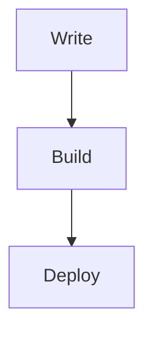

# Tang's Blog

Personal technical blog built with [Astro](https://astro.build/) and the
[Astro Cactus](https://github.com/chrismwilliams/astro-theme-cactus) theme.

## Local development

This project requires Node.js 22.

```bash
npm install
npm run dev
```

The development server is available at `http://localhost:4321`.

Before pushing changes, run:

```bash
npm run check
npm run build
```

## Writing

- Put regular posts in `content/posts/`.
- Put short notes in `content/notes/`.
- Use `.md` for normal articles and `.mdx` only when an Astro component is needed.
- Every post requires `title`, `description`, and `publishDate` frontmatter.

```yaml
---
title: Example post
description: A short summary used in post lists and search metadata.
publishDate: 2026-07-19
tags:
  - robotics
  - ros
draft: false
---
```

GitHub-flavored Markdown, code highlighting, admonitions, KaTeX math, Mermaid diagrams,
RSS, sitemap generation, and Pagefind search are enabled.

### Math

Use `$...$` for inline math or `$$...$$` for display math.

### Mermaid

Use a standard fenced code block:

````markdown

````

## Deployment

Pushes to `main` are checked, built, and deployed to GitHub Pages by
`.github/workflows/pages.yml`.

## Theme attribution

The site source is based on Astro Cactus, copyright Chris Williams and distributed
under the MIT License. See `LICENSE.theme`.
